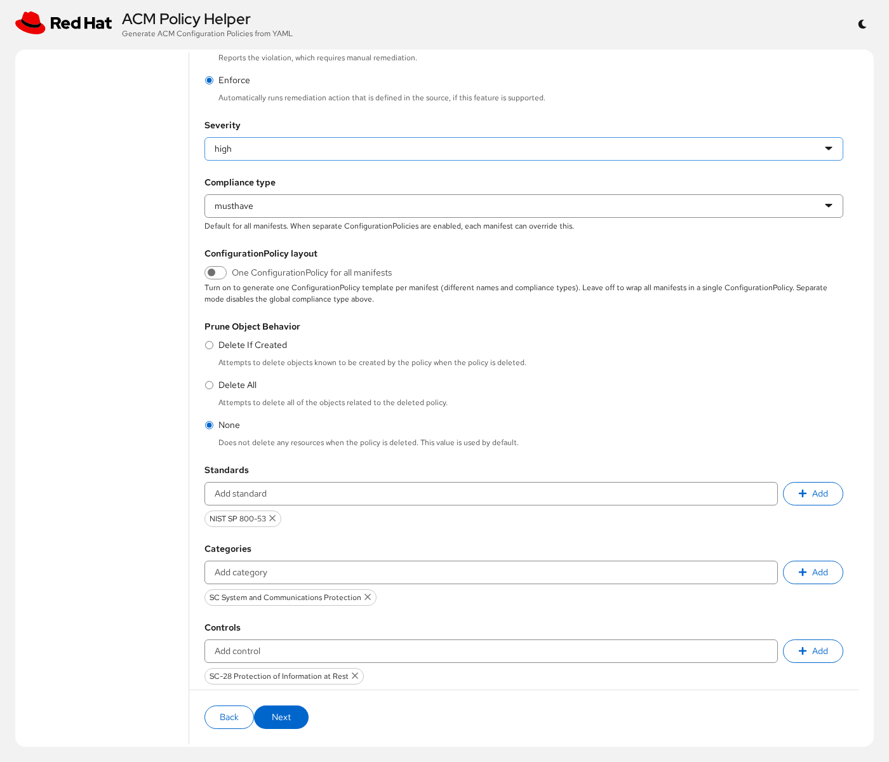
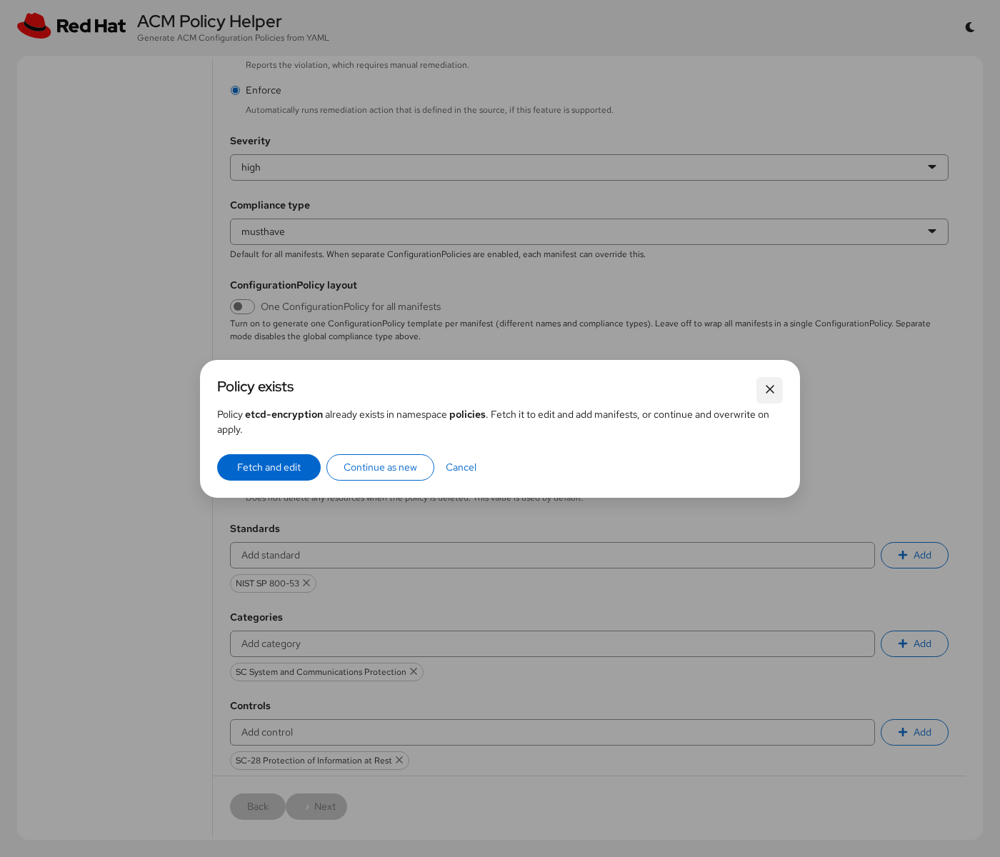

# ACM Policy Helper

Web UI for generating Open Cluster Management (ACM) governance policy bundles.

Produces a complete `Policy` (with `ConfigurationPolicy`), `Placement`, `PlacementBinding`, and optionally `ManagedClusterSetBinding` from Kubernetes YAML manifests or built-in templates.

Built-in templates cover cluster config and cluster health categories. Starters are adapted from:

- [bry-tam/acm-policy-samples](https://github.com/bry-tam/acm-policy-samples)
- [stolostron/policy-collection](https://github.com/stolostron/policy-collection)
- [ch-stark/etcd-backup-policy](https://github.com/ch-stark/etcd-backup-policy)

Many templates use PolicyGenerator `object-templates-raw` with Go templating (`lookup`, `dig`, and related helpers) so they evaluate dynamically on managed clusters. Replace any `PLACEHOLDER_*` values and review placement before applying.

## Deploy on OpenShift

Deployed with an OAuth-protected Route — opens with the cluster login page.

Requires `oc` logged into a cluster. Images used (mirror these for disconnected environments):

- `quay.io/rh-ee-ybeder/acm-policy-helper:latest`
- `registry.redhat.io/openshift4/ose-oauth-proxy-rhel9:v4.20`

```bash
./deploy/install.sh
```

This creates the namespace and oauth-proxy secret (if needed), applies manifests, pulls `latest`, waits for rollout, and prints the Route URL.

Pin a specific tag when needed:

```bash
IMAGE=quay.io/rh-ee-ybeder/acm-policy-helper:1.6.0 ./deploy/install.sh
```

## Usage

Non-linear wizard — steps can be opened in any order. Required fields (name, namespace) show PatternFly validation when empty. The output is a complete policy bundle ready to apply to the hub.

1. **Template** — pick blank or a built-in starter from the category list
2. **Policy settings** — name, namespace, remediation, severity, compliance type
3. **Placement** — cluster label selectors or ManagedClusterSets
4. **Manifests** — edit or upload YAML (including `object-templates-raw` content)
5. **Review** — generate, download, copy, or apply to the hub

If a policy with the same name already exists in the chosen namespace, leaving **Policy settings** opens a dialog: **Fetch and edit** loads the hub policy into the wizard, or **Continue as new** keeps your draft and overwrites on apply (`created` / `updated`).

## Screenshots

Example walkthrough using the **etcd encryption** template.

### Template selection

Browse built-in templates by category or search. The detail pane shows description and notes.


### Policy settings

Name, description, remediation, and severity are prefilled from the template; pick a namespace on the hub.


Scroll down for prune behavior and compliance metadata (standards, categories, controls).



### Placement

Target clusters with label selectors (shown: `vendor=OpenShift`) or ManagedClusterSets.


### Manifests

Template manifests are loaded and editable; you can also paste or upload additional YAML.


### Review & apply

Generated Policy / Placement / PlacementBinding — download, copy, or apply to the hub.


### Policy already exists

When the name and namespace match a policy on the hub, choose whether to fetch and edit it or continue and overwrite on apply.



## Compatibility

Compatible with ACM 2.15–2.17.

## Documentation

- [DEVELOPMENT.md](DEVELOPMENT.md) — local development, tests, image build and versioning
- [API.md](API.md) — HTTP API reference

## License

Apache-2.0
