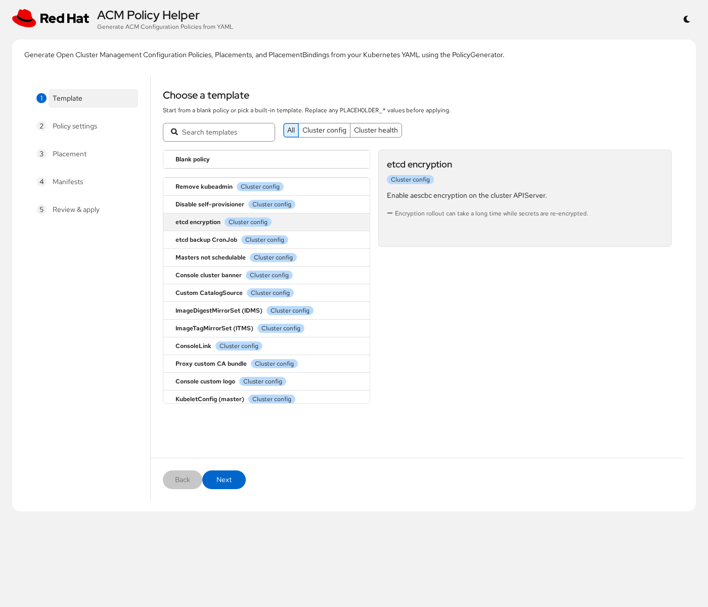
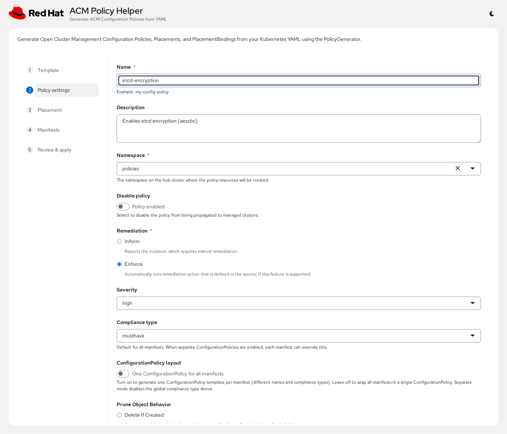
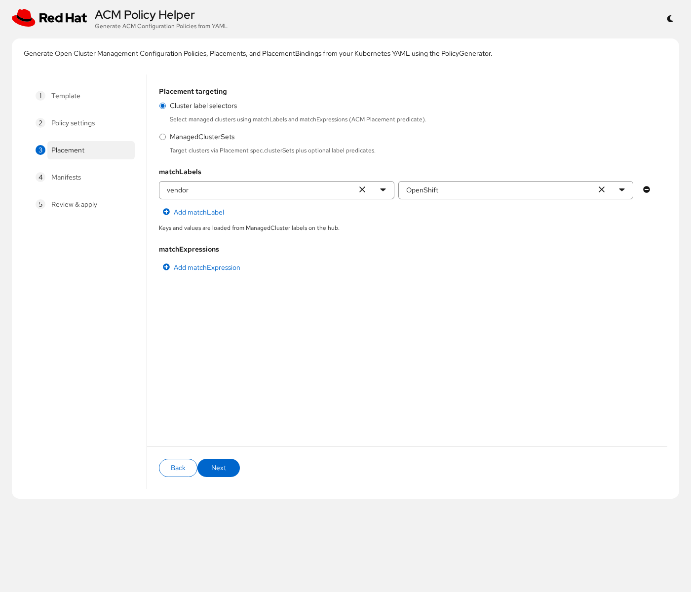
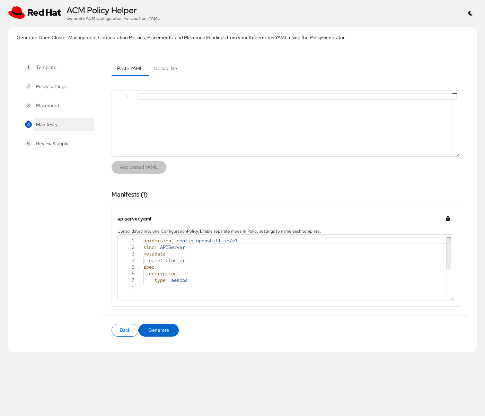
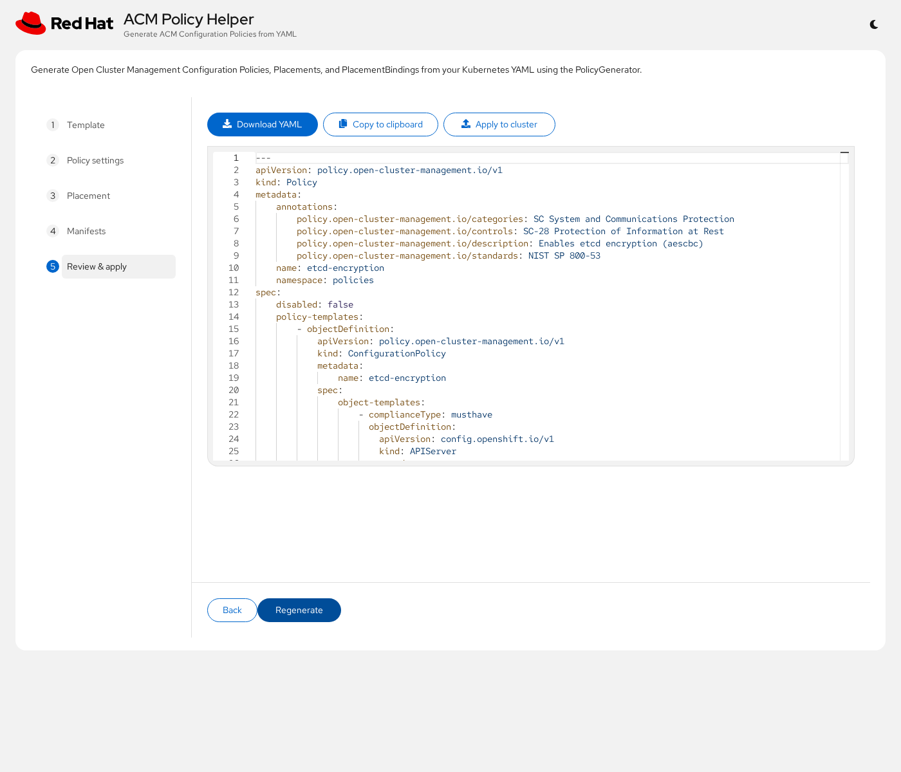

# ACM Policy Helper

Web UI to generate Open Cluster Management (ACM) Configuration Policies from Kubernetes YAML manifests.

Produces a `Policy` (with `ConfigurationPolicy`), `Placement`, `PlacementBinding`, and optionally `ManagedClusterSetBinding`. Runs on OpenShift behind OAuth so the Route opens with the cluster login page.

Built-in templates cover cluster config, cluster health, security, and access control. Starters are adapted from:

- [bry-tam/acm-policy-samples](https://github.com/bry-tam/acm-policy-samples)
- [stolostron/policy-collection](https://github.com/stolostron/policy-collection)
- [ch-stark/etcd-backup-policy](https://github.com/ch-stark/etcd-backup-policy)

Many templates use PolicyGenerator `object-templates-raw` with Go templating (`lookup`, `dig`, and related helpers) so they evaluate dynamically on managed clusters. Review names, placement, and any remaining site-specific values before applying.

## Deploy on OpenShift

Requires `oc` logged into a cluster that can pull:

- `quay.io/rh-ee-ybeder/acm-policy-helper:latest`
- `registry.redhat.io/openshift4/ose-oauth-proxy-rhel9:v4.20` (cluster pull secret / entitlement)

```bash
./deploy/install.sh
```

This creates the namespace and oauth-proxy secret (if needed), applies manifests, pulls **latest**, waits for rollout, and prints the Route URL. Open the URL and sign in with OpenShift OAuth.

Pin a specific tag when needed:

```bash
IMAGE=quay.io/rh-ee-ybeder/acm-policy-helper:1.6.0 ./deploy/install.sh
```

## Usage

Wizard steps can be opened in any order (same as ACM). Required fields (name, namespace) show PatternFly validation when empty.

1. **Template** — pick blank or a built-in starter from the category list
2. **Policy settings** — name, namespace, remediation, severity, compliance type
3. **Placement** — cluster label selectors or ManagedClusterSets
4. **Manifests** — edit or upload YAML (including `object-templates-raw` content)
5. **Review** — generate, download, copy, or apply to the hub

## Screenshots

Example walkthrough using the **etcd encryption** template.

### Template selection

Browse built-in templates by category or search. The detail pane shows description and notes.



### Policy settings

Name, description, remediation, and severity are prefilled from the template; pick a namespace on the hub.



### Placement

Target clusters with label selectors (shown: `vendor=OpenShift`) or ManagedClusterSets.



### Manifests

Template manifests are loaded and editable; you can also paste or upload additional YAML.



### Review & apply

Generated Policy / Placement / PlacementBinding — download, copy, or apply to the hub.



## More docs

- [DEVELOPMENT.md](DEVELOPMENT.md) — local run, tests, image build/versioning
- [API.md](API.md) — HTTP API reference

## License

Apache-2.0
